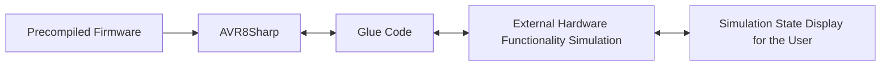

## AVR8Sharp

**AVR8Sharp** is a .NET Standard library designed to emulate the AVR-8 architecture. 
It is a port of the [avr8js](https://github.com/wokwi/avr8js) library, originally 
developed in TypeScript.

This library enables the execution of precompiled AVR-8 firmware and provides a 
robust framework for simulating AVR-8 microcontrollers within .NET environments. 
It is versatile and can be integrated into various types of applications, including 
console-based tools and graphical user interface (GUI) applications.


This library, like the original version, requires the following components to be provided:
- **Precompiled firmware**: The firmware to be executed must be precompiled and supplied.
- **Functional hardware simulation**: You need to implement the functional simulation of 
any external hardware interfacing with the microcontroller.
- **(Optional) Visual or audio representation**: If desired, a visual or audio 
representation of the simulated hardware can be added for enhanced interaction.
- 


### Installation

To install the library, you can use the NuGet package manager or the .NET CLI.

```bash
dotnet add package AVR8Sharp
```

or

```bash
Install-Package AVR8Sharp
```

### Usage

The library is designed to be easy to use with the Builder pattern. Here is an example
of how to create a new runner of the Arduino Uno (ATmega328p) board and load a firmware
from a HEX file.

```csharp
using AVR8Sharp;

class Program
{
    static void Main(string[] args)
    {
        // Load the firmware from a HEX file
        var file = File.ReadAllBytes("Serial.hex");
        var hex = Encoding.UTF8.GetString (file);
        
        // Create the AVR runner 
        var runner = AvrBuilder.Create () 
            .SetSpeed (16_000_000) 
            .SetWorkUnitCycles (1_000) 
            .SetHex (hex) 
            .AddGpioPort (AvrIoPort.PortBConfig, out _) 
            .AddGpioPort (AvrIoPort.PortCConfig, out _) 
            .AddGpioPort (AvrIoPort.PortDConfig, out _) 
            .AddUsart (AvrUsart.Usart0Config, out var usart) 
            .AddTimer (AvrTimer.Timer0Config, out _) 
            .AddTimer (AvrTimer.Timer1Config, out _) 
            .AddTimer (AvrTimer.Timer2Config, out _) 
            .Build ();
        
        // Add a listener when a byte is transmitted 
        var builder = new StringBuilder (); 
        usart.OnByteTransmit = b => { 
            var c = (char)b; 
            builder.Append (c); 
            if (c != '\n') return; 
            // Print the serial output 
            Console.WriteLine ($"Serial Output: {builder.ToString ().Trim ()}"); 
            builder.Clear (); 
        };
        
        while (true)
        {
            runner.Execute();
        }
    }
}
```

The above code snippet demonstrates how to create an AVR runner for the Arduino Uno,
and it is designed to run the following Arduino sketch:

```cpp
// Green LED connected to LED_BUILTIN,
// Red LED connected to pin 12. Enjoy!

void setup() {
  Serial.begin(115200);
  pinMode(LED_BUILTIN, OUTPUT);
}

void loop() {
  Serial.println(""AVR8Sharp is awesome!"");
  digitalWrite(LED_BUILTIN, HIGH);
  delay(500);
  digitalWrite(LED_BUILTIN, LOW);
  delay(500);
}
```

### Chips Supported

As a port of the [avr8js](https://github.com/wokwi/avr8js) library, **AVR8Sharp** 
primarily focuses on simulating the ATmega328p microcontroller. However, thanks
to its highly modular and configurable design, the library is capable of simulating
a wide range of microcontrollers within the AVR-8 family, including the ATmega2560 
and the ATtiny series.

### Testing

The library is tested using the NUnit testing framework. To run the tests, you can
use the following command:

```bash
dotnet test
```

### Roadmap

The following features are planned for future releases:
- [ ] Support for TWI (I2C) Slave mode

### License

Copyright (c) 2019-2023 Uri Shaked.

Copyright (c) 2025-present, Iván Montiel.

This project is licensed under the MIT License. For more information, please refer 
to the [LICENSE](LICENSE) file.
